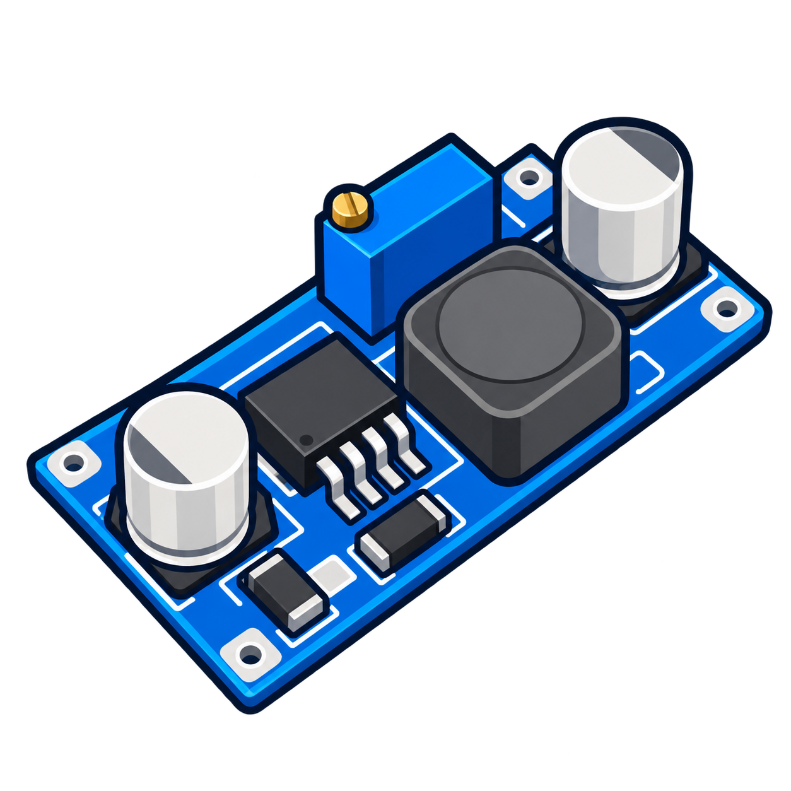

<p align="center"></p>

# ConvErtaLocAA

A small, offline Windows app for converting images and arranging photos and PDF pages.

**Drop files → choose a format → reorder pages → Convert.**

## Download and run

1. Open [Releases](https://github.com/Acethecoder2005/ConvErtaLocAA/releases/latest).
2. Download **ConvErtaLocAA-windows-x64.zip**.
3. Extract the entire ZIP into a folder.
4. Run **ConvErtaLocAA.exe**. Keep its `runtime`, `source`, and `assets` folders alongside it.

The portable release includes its Python runtime, image codecs, and PDF libraries. No Python installation, account, browser, or internet connection is required to use the app. It targets **Windows 10/11, 64-bit**, using Windows' .NET Framework.

Converted files appear in the **ConvErtaLocAA** folder on your Windows Desktop. Existing names receive a numeric suffix. Original input files are not modified.

## What it does

- Converts JPG/JPEG, PNG, WebP, BMP, TIFF, and AVIF images.
- Reads HEIC/HEIF photos using a bundled local decoder.
- Turns photos into a PDF, one photo per page.
- Combines PDFs and individual PDF pages.
- Mixes photos and pages from different PDFs in the same document.
- Exports PDF pages as images at a chosen resolution.
- Previews pages before converting.
- Reorders, rotates, duplicates, and removes queue entries.
- Preserves text and vector content when copying PDF pages.

**HEIC output is not included in the standard release.** HEIC input is supported. The source also recognizes an optional local HEIF encoder if one is installed separately.

## Using the queue

1. Drag images or PDFs onto the window, or choose **Add files**.
2. Each photo and PDF page becomes one row. Multi-page TIFFs also expand into rows.
3. Drag rows to choose the output order, or use **Move up / Move down**.
4. Use **Rotate**, **Duplicate**, **Remove**, or **Clear** as needed.
5. Choose **PDF** to make one combined document, or an image format to create one image per row.
6. Click **Convert**, then **Open folder**.

Use **Ctrl-click** or **Shift-click** to select multiple rows, **Ctrl+A** to select all, **Delete** to remove selections, and **Alt+Up / Alt+Down** to move selected rows.

For photo PDFs, choose **Fit image**, **Letter**, or **A4**. Photos fit without cropping. JPG, WebP, and AVIF have a quality control. PDF image exports have a DPI control.

## Privacy

Processing stays on the computer. The app has no upload service, telemetry, advertising, account system, automatic updater, or local HTTP server.

The Windows interface communicates with its Python worker through local pipes. The worker uses Python's isolated mode and rejects Python socket connection, binding, DNS, and send-to audit events. This guard is not a network sandbox for native libraries; the project does not claim that third-party binaries have been independently audited.

- Only files selected by the user are opened for conversion.
- Preview images and decoded HEIC data may be stored in a random temporary session folder.
- The session folder is deleted on normal exit; a forced termination can leave temporary data behind.
- The app does not save a file-history database.
- Converted images have EXIF/GPS and XMP metadata removed after applying orientation. ICC color profiles are retained.
- Copied PDF pages are **not** scrubbed of their existing metadata or annotations.

The repository contains application code, its generated logo, documentation, and build configuration. It contains no personal photos, documents, conversion results, or local application history. Tests create synthetic files and use a public upstream HEIC fixture only during CI.

## Limits

- HEIC export, OCR, and Live Photo video export are not included.
- GIF input uses the first frame.
- Password-protected PDFs need an unlocked copy; empty-password PDFs may be accepted.
- Combining PDFs does not preserve digital signature validity.
- Transparent areas become white in JPG, BMP, and photo PDF output.
- The queue is limited to 2,000 pages.

## Build from source

Requirements: Windows x64, Python **3.12**, and Windows' .NET Framework C# compiler. The compiler normally lives under `%WINDIR%\Microsoft.NET\Framework64\v4.0.30319\csc.exe`.

From a PowerShell terminal in the repository:

```powershell
py -3.12 -m venv .venv
.\.venv\Scripts\python.exe -m pip install --only-binary=:all: -r requirements.txt
powershell -ExecutionPolicy Bypass -File .\source\build.ps1 -PythonPath .\.venv\Scripts\python.exe
```

The result is `dist\ConvErtaLocAA\ConvErtaLocAA.exe`. The build copies only the interpreter, explicitly listed dependencies, application sources, logo, and documentation. It does not copy arbitrary files from the working directory or Desktop.

Dependency installation and the GitHub build need internet access. The built application does not.

To run integration tests:

```powershell
.\.venv\Scripts\python.exe -B .\source\test_engine.py .\test-output
```

Pass a HEIC fixture path as the final argument to include the optional HEIC test. Generated test files are ignored by Git.

## Project structure

| Path | Purpose |
| --- | --- |
| `source/ConvErtaLocAA.cs` | Native Windows interface and drag-and-drop queue |
| `source/engine.py` | Local image/PDF conversion worker |
| `source/test_engine.py` | Integration tests |
| `source/build.ps1` | Windows build entry point |
| `tools/` | Portable packaging and release-source collection |
| `assets/` | App logo and Windows icon |
| `requirements.txt` | Pinned runtime dependencies |
| `.github/workflows/windows.yml` | Build, test, and release on GitHub |

## Dependencies and notices

See [THIRD_PARTY_NOTICES.md](THIRD_PARTY_NOTICES.md). Dependency license texts are retained in the portable package. Companion source archives are attached to releases for the bundled HEIC decoder and its native libraries.

The converter-board logo is an AI-generated illustration created for this project. No project-wide reuse license has been selected; third-party components retain their own licenses.
